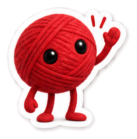
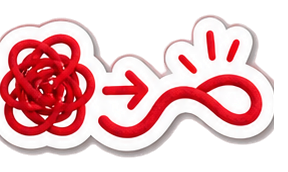
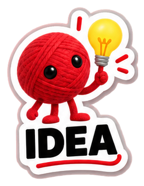
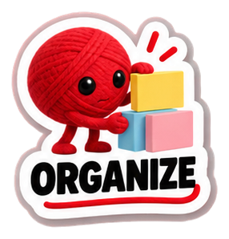
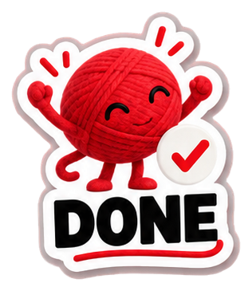

<p align="center">
  
</p>

<h1 align="center">Your ideas. One canvas.</h1>

<p align="center">
  A visual workspace for untangling ideas, planning projects, and connecting the details.
  <br />
  Notes, sketches, diagrams, data, and a little Wevi personality.
</p>

<p align="center">
  <a href="#what-you-can-do">Explore</a> &middot;
  <a href="#get-started">Get started</a> &middot;
  <a href="#er-diagrams">ER diagrams</a> &middot;
  <a href="#inside-the-repo">Inside the repo</a>
</p>

<p align="center">
  
  &nbsp;&nbsp;
  
</p>

## What you can do

Thread brings different kinds of work into the same canvas. Start with a thought, add some structure, and follow the connections.

| Make room for | With |
| :--- | :--- |
| **Ideas** | Sticky notes, rich text, freehand drawing, images, links, and files. |
| **Plans** | Tasks, checklists, frames, and zones to organize the board. |
| **Diagrams** | Flowchart shapes, themed fills, and straight, curved, or elbow connectors. |
| **Database design** | ER entities, editable fields, keys, relationships, automatic layout, and DBML export. |
| **Data** | Tables, charts, shared datasets, and budget cards. |
| **Personality** | A searchable sticker picker with 66 Wevi stickers, SVG essentials, and recent picks. |

The interface includes light, dark, and system themes, custom Thread controls, responsive panels, and touch gestures for moving around the board.

**Storage:** spaces and canvas content are saved in the current browser's local storage. This version does not sync boards between devices or provide live collaboration. Clearing browser storage removes saved work.

## Get started

Use a Node.js version supported by the installed Angular CLI: **22.22.3+ within Node 22**, **24.15.0+ within Node 24**, or **26+**. The repo specifies **npm 11.13.0**.

```sh
npm ci
npm start
```

Open [localhost:4200](http://localhost:4200), create a space, and start adding to your canvas.

### Your first board

1. Create or open a space from the spaces screen.
2. Use **Add** to place notes, tasks, media, or data cards.
3. Sketch an idea, add shapes, and connect the pieces.
4. Organize the board with frames or zones, then add a sticker to mark the moment.

### Optional GIF search

The included stickers work without an API key. To enable live GIPHY GIF and sticker search, set `GIPHY_API_KEY` in [giphy.config.ts](src/app/features/canvas/giphy.config.ts). Requests are made directly from the browser.

## ER diagrams

Start with **Add > ER diagram starter** for a connected Customer/Order example, or add an **ER entity** to design your own schema.

| To | Do this |
| :--- | :--- |
| Rename an entity or field | Click its name directly on the card while using Select. |
| Set a field's type | Use the type picker in its row. |
| Add another field | Click **+ Add field**, or press **Enter** while editing a field name. |
| Configure a field | Open its settings button for keys, required/unique rules, enum values, and custom SQL types. |
| Create a foreign key | Choose a primary or unique field in the **Relationship** picker. Thread adds the connection and follows the target's data type. |
| Remove a foreign key | Choose **No relationship** to remove the constraint and its connection. |
| Add a connected entity | Use **+ Related entity**. |
| Tidy the layout | Use **Arrange diagram** to space entities into columns and reset automatic routing. |
| Take the schema with you | Use **Export DBML** to download fields, enums, constraints, and references. |

Field settings open beside the canvas without changing your pan or zoom, and become a bottom sheet on mobile. Defaults, notes, field order, and deletion are available in the same editor. Automatic relationship routes use separate ports and avoid entity cards.

## Canvas shortcuts

| Action | Shortcut |
| :--- | :--- |
| Select | `V` |
| Pan | `H`, or hold `Space` |
| Add an item | `N` |
| Text / shapes / drawing / connections | `T` / `S` / `P` / `C` |
| Duplicate | `Ctrl/Cmd + D` |
| Group / ungroup | `Ctrl/Cmd + G` / `Ctrl/Cmd + Shift + G` |
| Undo / redo | `Ctrl/Cmd + Z` / `Ctrl/Cmd + Shift + Z` |
| Delete selection | `Delete` or `Backspace` |
| Cancel the current action | `Esc` |

On touch devices, use **Pan** to move the board or use two fingers to pan and pinch to zoom. Use **Select** to work with items.

## Meet Wevi

<p align="center">
  
  &nbsp;&nbsp;
  
  &nbsp;&nbsp;
  
</p>

Our little red thread shows up for the brainstorm, the messy middle, and the finished board. The sticker picker groups the collection into **Wevi Actions**, **Moments**, **Canvas Icons**, and **Workflow**, alongside Essentials and Recent picks.

The clean PNG collection lives in [public/stickers/wevi](public/stickers/wevi). Its [manifest](public/stickers/wevi/manifest.json) records the files and dimensions; [wevi-stickers.ts](src/app/features/canvas/wevi-stickers.ts) supplies the picker labels, categories, and search terms. The original SVG essentials live in [public/stickers](public/stickers).

When adding stickers, keep each asset's category, filename, and registry ID aligned. Preserve existing URLs so saved boards can still find their stickers.

## Inside the repo

Built with **Angular 22**, **TypeScript**, **Tailwind CSS 4**, **Tiptap**, **ECharts**, **Moveable**, and **perfect-freehand**. Unit tests use **Vitest** and **jsdom**.

```text
src/app/
  features/
    canvas/
      components/       Cards, charts, rich text, and the media picker
      data/             Shared table, chart, and budget datasets
      pages/            Canvas interaction and layout
      sketch/           Drawing and connector geometry
      transform/        Selection and resize controls
      er-layout.ts      ER arrangement and relationship routing
      er-schema.ts      Field validation and DBML export
      shapes.ts         Shape paths, names, and color themes
    spaces/             Space management
    settings/           App preferences
  layouts/              App and canvas shells
  shared/
    controls/           Thread dropdowns, checkboxes, and color pickers
public/stickers/        SVG essentials and the Wevi PNG collection
```

### Shared controls

[Thread controls](src/app/shared/controls/thread-controls.ts) provide searchable dropdowns, checkboxes, and color pickers using the app's theme tokens. They support keyboard navigation, accessible labels, and disabled states. Floating menus attach to the document body so canvas transforms and scrolling panels do not clip them.

Dropdown entries use `thread-option` with a value and label. Existing change handlers receive `event.target.value` or `event.target.checked`. The color picker supports swatches, hue/saturation/brightness, and validated hex values, committing a drag on release.

### Development commands

| Command | Purpose |
| :--- | :--- |
| `npm start` | Run the local development server. |
| `npm run build` | Create the production bundle in `dist/`. |
| `npm run watch` | Rebuild the development bundle as files change. |
| `npm test` | Run the Angular unit test runner. |

To run focused canvas and control unit tests directly:

```sh
npx vitest run src/app/features/canvas/pages/canvas-page/canvas-input.spec.ts src/app/shared/controls/thread-controls.spec.ts --environment jsdom
```

### Working on Thread

Keep controls consistent with the existing theme, preserve stored board data and asset IDs, and cover changes to canvas interactions or schema behavior with focused unit tests. For UI changes, consider keyboard, mouse, and touch workflows together.

Design references: [DBML schema conventions](https://dbml.dbdiagram.io/docs/) and [draw.io flowchart shapes](https://www.drawio.com/docs/getting-started/basic-flowchart/).

<p align="center">
  <sub>Start with a thought. Follow the thread.</sub>
</p>
